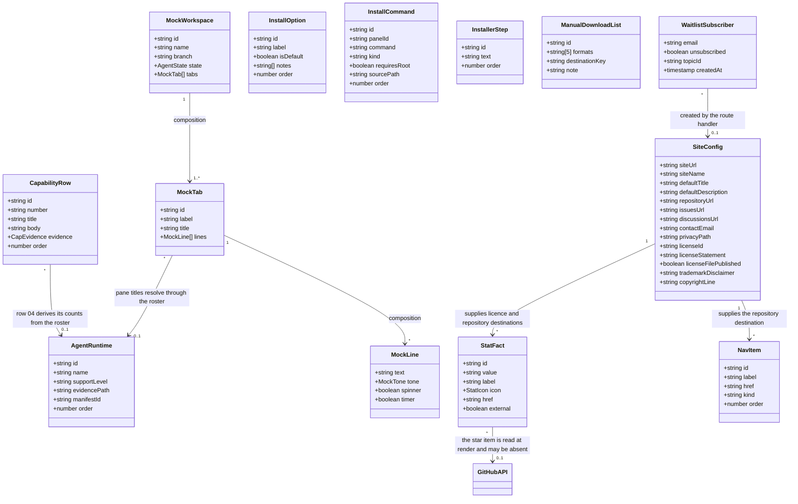

# Data Model: Bentomux Landing Page

**Document:** SoT-6 | **Derived From:** SoT-4 (User Flows) — NOT directly from SRS | **Version:** v1.3 | **Status:** Draft | **Last Updated:** 2026-09-15

> **Critical:** This model is derived from User Flows (how data is created, read, updated, validated in real behaviour), not from the SRS. It was built by collecting the `Data Used` table of every flow in `docs/user_flows/` and reconciling the entities that appear across them.

## 1. Overview

The landing page has no database. `CON-001` fixes the stack to Next.js alone, and `CON-011` removes any CMS, so every fact the site displays is authored in TypeScript content modules under `src/content/` and validated at build time. This model therefore describes two different kinds of data, and the difference is deliberate:

- **Authored content entities (ENT-001, ENT-003, ENT-005, ENT-008 … ENT-015)** — read-only at runtime, versioned in git, validated by a schema when the site builds. They are the shape the flows in `docs/user_flows/` refer to by name. "Create" and "update" for these entities mean a commit, not a request.
- **One external record (ENT-008, `WaitlistSubscriber`)** — the only entity a visitor creates at runtime. It lives in Resend, not on our infrastructure. The site is a writer to it and a reader of it, and it holds no copy.
- **One external read (inside ENT-015, `StatFact`)** — the GitHub star count, read at render time and never stored. Unlike every other entity it can be absent, and the model states what happens then (§3, ENT-015).

The flows that shaped the model are UC-001 (browse), UC-002 (join the waitlist), UC-003 (install), UC-004 (agent runtimes), UC-006 (project links, now only the footer destinations), and UC-008 (licensing and privacy). UC-005 (FAQ-driven questions) and UC-007 (theme preview) are retired; `ENT-002`, `ENT-004`, `ENT-006` and `ENT-007` went with them in v1.2. Every remaining entity below traces to at least one live flow in §9.

Two entities carry accuracy risk rather than behavioural risk, and the model exists mainly to constrain them:

- `AgentRuntime` (`ENT-003`) — the repository evidences **21** detectable agents and **9** configurable ones. The two numbers must never be conflated (`BR-003.3`). Since v1.2 this roster no longer has a section of its own: the two counts are rendered by capability row 04 (`ENT-013`) and by the stat strip (`ENT-015`).
- `StatFact` (`ENT-015`) — the strip exists so the page can state what it knows and nothing else. The only figure it does not own is the star count, and a failed read removes the item rather than filling the gap (`BR-002.3`).

## 2. Class Diagram



## 3. Entity Descriptions

Notation: **PK** = the attribute that identifies an entry within its module. **Module** = the single file that is the definition site. Every entity here is a singleton or an array in exactly one module (`NFR-006.6`).

### ENT-001: SiteConfig
*Purpose:* The singleton that owns every site-level fact: identity, canonical base, the four outbound destinations, and the complete legal block rendered in the footer and on `/privacy`. `XPG-001` requires the legal statements to be identical in both places, so they are defined once here and consumed twice.

| Attribute | Type | Constraint | Description |
|-----------|------|------------|-------------|
| siteUrl | string | PK (singleton), NOT NULL, absolute `https` URL | Canonical base for canonical tags, Open Graph URLs, `sitemap.xml`. Read from `NEXT_PUBLIC_SITE_URL`; a missing or unparseable value fails the build (`NFR-004.2`, `LP-005`). |
| siteName | string | NOT NULL, exactly `Bentomux` | Product name used in the title template and structured data. |
| titleTemplate | string | NOT NULL, must contain `%s` | Next.js metadata title template. |
| defaultTitle | string | NOT NULL, ≤ 60 characters | Home page title, and the template filler for pages without their own. |
| defaultDescription | string | NOT NULL, ≤ 160 characters | Home page meta description. |
| repositoryUrl | string | NOT NULL, absolute `https` URL | `https://github.com/takora-dev/bentomux-v2`. Sole source for every repository link (`BR-007.1`). |
| releasesLatestUrl | string | NOT NULL, absolute `https` URL | `https://github.com/takora-dev/bentomux-v2/releases/latest`. Sole destination for the manual-download line (`FR-005.11`, `ENT-012`). The install commands carry their own raw script URLs inside `InstallCommand.command` and do not resolve through this field. |
| issuesUrl | string | NOT NULL, absolute `https` URL | Bug-report destination. Rendered from the footer's support group since `SEC-009` was retired in v1.2 (`FR-007.1`). |
| discussionsUrl | string | NOT NULL, absolute `https` URL | Question destination. Rendered from the footer's support group since `SEC-009` was retired in v1.2 (`FR-007.1`). |
| contactEmail | string \| null | Optional; read from `NEXT_PUBLIC_CONTACT_EMAIL`, must contain `@` when set | Private-enquiry destination; rendered only as a `mailto:` link, and only while the value is set (`FR-007.5`, `BR-007.4`). No address exists in either repository, so `null` is the honest default rather than an invented address. |
| privacyPath | string | NOT NULL, exactly `/privacy` | Path consumed by the footer and the consent statement. |
| licenseId | string | NOT NULL, equals the licence declared in the application repository's `LICENSE` file | `MIT`. The schema fails the build if this disagrees with the repository (`BR-009.1`). |
| licenseStatement | string | NOT NULL, non-empty | Rendered licence sentence. `MIT` is stated plainly while `licenseFilePublished` is `true` (`FR-009.7`). |
| licenseFilePublished | boolean | NOT NULL, `true` today | Gate for `FR-009.7`. `true` renders the plain statement and permits a licence-file link; `false` selects the deferred sentence and suppresses the link (`BR-009.2`). Reflects `LP-001`, which is satisfied. |
| trademarkDisclaimer | string | NOT NULL, equals the approved wording | States that agent and vendor names belong to their owners and that use implies no affiliation (`FR-009.3`). |
| copyrightLine | string | NOT NULL, must not name an organisation that does not exist | Copyright notice. Names the project, not a fabricated legal entity (`BR-009.8`). |

### ENT-002: FeatureHighlight — Removed (v1.2, 2026-09-14)
*Retired with the `#features` band, `SEC-004`; the id stays retired and is never reused.* Six entries paired copy with a product visual and named the application feature behind the claim. The band was removed when the landing page was rebuilt to the six-band structure, and `src/content/features.ts` and `src/components/sections/FeaturesSection.tsx` were deleted. Its job — naming the repository evidence for a claim — left the page with the capability rows' repository-evidence line on 2026-09-15; `ENT-013` still carries the evidence panel that shows the claim, but no longer stores or renders a path (`BR-002.1` as amended).

### ENT-003: AgentRuntime
*Purpose:* One entry per detected agent runtime. This entity exists to keep two counts apart: **21** agents the application detects, of which **9** are fully configurable. The distinction is stated in the copy and enforced here.

Since v1.2 the roster has no section of its own. It is read in two places and rendered from the module in both: capability row 04 (`ENT-013`, which prints the detected count in its claim and both counts in its panel note) and the stat strip (`ENT-015`, which prints the detected count as the `runtimes` fact). The stat strip carries no copy that names the roster, so the two renderings cannot disagree.

| Attribute | Type | Constraint | Description |
|-----------|------|------------|-------------|
| id | string | PK, UNIQUE, slug | Identifier, aligned with the manifest id where one exists. |
| name | string | NOT NULL, UNIQUE | Display name as the application's adapter reports it (`AgentInfo.name`), not the manifest id. |
| supportLevel | string | NOT NULL, enum: `detected` \| `configurable` | `detected` = the application recognises the agent's pane state. `configurable` = the application also reads and writes its configuration. Exactly 9 entries carry `configurable` (`BR-003.1`, `BR-003.2`). |
| evidencePath | string | NOT NULL | Repository artifact proving the level: `resources/manifests/<id>.toml` for `detected`, `src-tauri/src/agents/index.rs` for `configurable`. |
| manifestId | string \| null | UNIQUE when present | Manifest backing pane detection. `null` only for an agent that is configurable without a manifest, which is the QwenPaw case (`BR-003.6`). |
| order | number | UNIQUE within the module | Render order. |

**Count invariants:** `count(supportLevel = detected)` = 21; `count(supportLevel = configurable)` = 9; `count(manifestId = null)` = 1. When the application adds an adapter or a manifest the roster is re-verified (`LP-006`).

### ENT-004: PaletteOption — Removed (v1.2, 2026-09-14)
*Retired with the `#palettes` band, `SEC-005`; the id stays retired and is never reused.* Eight entries, each a transcription of one of the application's theme token blocks, driving an interactive preview. The band, `src/content/palettes.ts`, `src/components/sections/PalettesSection.tsx` and the `palette-*` rules in `globals.css` were deleted. Nothing in the site now reads the application's palette tokens; the site has one theme of its own, and it is the Bentomux blue the design system fixes (`--color-accent: #4c8ef9`). The v1.1 rules `BR-008.1`–`BR-008.4` are retired with it.

### ENT-005: InstallOption
*Purpose:* One entry per OS panel in `SEC-006`. Exactly three entries — macOS, Linux, Windows — with exactly one selected in the server-rendered HTML, so the section is honest and complete before any script runs (`FR-005.1`, `FR-005.2`). The commands inside each panel live in `ENT-010`; the prose notes are owned here.

| Attribute | Type | Constraint | Description |
|-----------|------|------------|-------------|
| id | string | PK, UNIQUE, enum: `macos` \| `linux` \| `windows` | Panel identifier. |
| label | string | NOT NULL, enum: `macOS` \| `Linux` \| `Windows` | Switcher option text. Operating system name only, no architecture (`BR-005.7`). |
| isDefault | boolean | exactly one `true`, and it must be `macos` | Which option the server renders as checked, and therefore which panel is visible before any interaction (`FR-005.2`). |
| notes | string[] | NOT NULL, 0–3 items, each non-empty | Notes rendered beneath the panel's command: the unsigned-build disclosure on macOS, the root requirement and libfuse2 remedy on Linux, the no-administrator-rights statement on Windows (`FR-005.7`–`FR-005.9`). |
| order | number | UNIQUE within the module | Render order of the switcher options and the panels. |

### ENT-006: FaqItem — Removed (v1.2, 2026-09-14)
*Retired with the `#faq` band, `SEC-008`; the id stays retired and is never reused.* Eight entries covering seven SRS-mandated topics plus an affiliation question, rendered as an accordion that stayed readable without scripting. The band, `src/content/faq.ts` and `src/components/sections/FaqSection.tsx` were deleted, and the `faq-answer` / `faq-chevron` CSS rules with them. Two of the answers carried statements that were meant to survive in `ENT-001` — the upstream credit and the non-affiliation statement. **Both were removed on 2026-09-15**: the port claim they discharged was withdrawn, so `upstreamUrl`, `attributionStatement` and `nonAffiliationStatement` no longer exist on `ENT-001`. The licence statement and the trademark disclaimer do still render in the footer.

The remaining questions answered on the retired questions — pricing, release timing, platform support, agent compatibility, data handling and contributing — are now answered by the band that owns each fact: the install section answers platforms, capability row 04 answers agent compatibility, the waitlist band and the consent line answer data handling, and the footer answers contributing and pricing (`ENT-001.licenseId`). `FR-006.1`–`FR-006.7` are retired.

### ENT-007: CommunityLink — Removed (v1.2, 2026-09-14)
*Retired with the `#community` band, `SEC-009`; the id stays retired and is never reused.* Four cards — star, bug, question, email — each naming a `SiteConfig` field instead of holding a URL. The band, `src/content/community.ts` and `src/components/sections/CommunitySection.tsx` were deleted. The four destinations still exist and are still owned by `ENT-001`; they are reached from the footer, which renders `ENT-009` plus the project and support groups (`src/content/chrome.ts` — `footerGroups`). `FR-007.2` is retired; `FR-007.1`, `FR-007.5` and `FR-007.6` continue to hold on the footer links.

### ENT-008: WaitlistSubscriber
*Purpose:* The only record a visitor creates. It is stored in Resend Contacts, not locally (`CON-001`, `NFR-005.2`). The landing page writes it through `POST /api/waitlist` (UC-002) and reads it only to avoid creating a duplicate.

| Attribute | Type | Constraint | Description |
|-----------|------|------------|-------------|
| email | string | PK (assigned by Resend), NOT NULL, valid address, ≤ 254 characters, local part ≤ 64 characters | The address the visitor submitted, stored as typed apart from surrounding whitespace, which is trimmed. Duplicate detection compares case-insensitively. |
| unsubscribed | boolean | NOT NULL, set to `false` on create | Resend's own state. The site never sets it to `true`; removal is performed on request by the maintainer. |
| topicId | string \| null | Optional; value from `RESEND_TOPIC_ID`, a server-only environment variable | Waitlist topic the contact is assigned to, when configured. Absent means the contact is created without a topic, which stays valid (`FUT-002`). |
| createdAt | timestamp | Assigned by Resend | Creation time. Not displayed anywhere on the site. |

**Not persisted by the site:** the request body, the honeypot value, the client IP used for the rate limit, and any submission log. `NFR-002.4` forbids logging the address; the rate limit is in-process and is discarded with the function instance (`CON-012`).

### ENT-009: NavItem
*Purpose:* One entry per navigation destination, shared by the navigation bar and the footer's anchor group so the two cannot drift (`FR-001.3`, `FR-001.6`).

| Attribute | Type | Constraint | Description |
|-----------|------|------------|-------------|
| id | string | PK, UNIQUE | Identifier. |
| label | string | NOT NULL | Visible text. |
| href | string | NOT NULL | Either a same-page anchor matching a `SEC-*` id, an absolute external URL, or the download action trigger. Anchors must resolve to a section that exists (`BR-001.4`, `IA URL-004`). |
| kind | string | NOT NULL, enum: `anchor` \| `external` \| `action` | Drives rendering: `anchor` scrolls with heading clearance, `external` opens a new context with `rel` attributes, `action` jumps to the install section. No nav entry opens a dialog (`FR-001.3`). Since v1.2 the module holds two anchors (`#capabilities`, `#install`); `action` remains unused and is kept because `FR-001.6` still requires the shared shape. |
| order | number | UNIQUE within the module | Render order. The two anchors appear before the GitHub link and the primary action, which are exported separately (`navExternal`, `navPrimary`) so the footer can share the anchor list alone (`FR-001.3`, `FR-001.6`). |

### ENT-010: InstallCommand
*Purpose:* One command rendered inside a panel. Every entry transcribes a string that already exists in the application repository, which is exactly what `BR-005.1` makes auditable instead of asserted.

| Attribute | Type | Constraint | Description |
|-----------|------|------------|-------------|
| id | string | PK, UNIQUE, kebab-case, stable | Identifier, e.g. `macos-install`, `linux-deb`, `windows-cmd-fallback`, `pin-example`. |
| panelId | string | FK → `InstallOption.id` | Which panel renders it. The `pin` entry renders in the macOS panel, which is the default panel, and names the installer it pins in its caption. |
| command | string | NOT NULL, non-empty, exactly one line (no `\n`) | The command as rendered. Multi-line or wrapped forms are forbidden so the block scrolls horizontally rather than re-flowing (`CMD-003`). |
| kind | string | NOT NULL, enum: `install` \| `fallback` \| `pin` | Role. Exactly one `install` per panel, at most one `fallback`, exactly one `pin` in the module (`FR-005.9`, `FR-005.12`). |
| requiresRoot | boolean | `true` only for the Linux `--deb` command | Drives the root note beside that command. No other entry may set it (`BR-005.5`). |
| sourcePath | string | NOT NULL, repository-relative path | Where the string is copied from, e.g. `installers/install.sh`, `installers/install.ps1`, `installers/install.cmd`, `README.md`. Turns the drift check into a string comparison (`BR-005.1`, `BR-005.9`). |
| order | number | UNIQUE within the panel | Render order inside the panel. |

### ENT-011: InstallerStep
*Purpose:* One entry per item of the "what the installer does" list. Exactly three entries, each describing behaviour the installer scripts actually implement (`FR-005.10`).

| Attribute | Type | Constraint | Description |
|-----------|------|------------|-------------|
| id | string | PK, UNIQUE | Identifier. |
| text | string | NOT NULL, one sentence | The step as rendered: resolve the release manifest, verify the download against its SHA-256 digest and refuse a mismatch, then install without administrator rights. A step may not claim behaviour the scripts do not have (`BR-009.7`). |
| order | number | UNIQUE, exactly the values 1–3 | Render order. |

### ENT-012: ManualDownloadList
*Purpose:* The single manual-download line. Five artifact formats and one destination, so the section offers an escape hatch without becoming a second install interface (`FR-005.11`).

| Attribute | Type | Constraint | Description |
|-----------|------|------------|-------------|
| id | string | PK, singleton, exactly `manual-downloads` | Identifier. |
| formats | string[5] | NOT NULL, exactly five literal file suffixes | `.dmg`, `.AppImage`, `.deb`, `.msi`, `-setup.exe`. Rendered as text inside one sentence, not as five links (`CMD-005`). |
| destinationKey | string | NOT NULL, must name an existing `SiteConfig` field | Resolves to `SiteConfig.releasesLatestUrl`. The list owns no URL of its own (`BR-007.1`). |
| note | string | NOT NULL, one sentence | States that these are the assets attached to the latest release, for anyone who prefers to install by hand (`FR-005.11`). |

### ENT-013: CapabilityRow
*Purpose:* One entry per numbered row of `SEC-013` (`#capabilities`), the band that replaced the feature blocks, the roster and the palette preview in v1.2. Five entries. A row is one claim with two obligations attached: it says something the application does, and it carries an evidence panel that shows the claim rather than restating it (`BR-002.1`, `FR-002.4`).

| Attribute | Type | Constraint | Description |
|-----------|------|------------|-------------|
| id | string | PK, UNIQUE, enum: `persistent` \| `state` \| `approvals` \| `runtimes` \| `remote` | Identifier. Anchor-safe and stable; the row renders at `#cap-<id>` (`IA URL-004`). |
| number | string | NOT NULL, exactly `01`–`05` | The displayed ordinal, zero-padded. Kept as a string so the row reads as a terminal line rather than a list marker (`BR-002.4`). |
| title | string | NOT NULL, one sentence | The claim as a heading. States an outcome, not a feature name (`BR-002.2`). |
| body | string | NOT NULL, one paragraph | Plain-language explanation. Row `runtimes` contains the detected-agent count interpolated from `ENT-003`; the schema fails the build if that number is typed as a literal instead (`BR-003.3`). |
| evidence | CapEvidence | NOT NULL | Which panel the row draws, and its data. The union is exactly five kinds — `tabs`, `states`, `approval`, `runtimes`, `machines` — one per row, so no two rows can share a panel shape by accident. |
| order | number | UNIQUE within the module, exactly 1–5 | Render order. The rendered `number` must match this value padded to two digits. |

**Count invariants:** exactly 5 entries; each `evidence.kind` appears exactly once; `capabilities[3]` (`runtimes`) carries the derived count in `body` and both counts in its panel note, read from `ENT-003` and never typed.

### ENT-014: AppMock
*Purpose:* The window figure of `SEC-012` (`IA FIG-001`). Not a screenshot and not a store of product facts: it is a drawn window whose panes, tabs, workspace states and tab labels describe surfaces the application really has, so a visitor can look at each one before reading the rows that explain it (`MOCK-004`).

Three shapes, all in `src/content/mock.ts`:

| Shape | Attribute | Type | Constraint | Description |
|-------|-----------|------|------------|-------------|
| `MockWorkspace` | id / name | string | PK, UNIQUE | Workspace identifier and the label the sidebar shows. |
| `MockWorkspace` | branch | string | NOT NULL | Branch label under the name. Purely illustrative; it names no real branch of this repository (`BR-002.3`). |
| `MockWorkspace` | state | `AgentState` | enum: `working` \| `blocked` \| `idle` \| `done` | The three words plus `done` that the application uses for a tab. Drives the dot in the sidebar row; the pane repeats the word in text (`CLR-003`). |
| `MockWorkspace` | tabs | `MockTab[]` | NOT NULL, ≥ 1, unique ids | Panes the workspace holds. |
| `MockTab` | id / label | string | PK within its workspace, UNIQUE | Tab identifier and the label on the tab. |
| `MockTab` | title | string | NOT NULL | The process the pane runs. For a pane whose process is a detected runtime the value is resolved from `ENT-003` by id, so the mock cannot name an agent the roster does not have. |
| `MockTab` | lines | `MockLine[]` | NOT NULL | The pane's rendered output. |
| `MockLine` | text / tone | string / enum: `text` \| `muted` \| `accent` \| `warn` \| `ok` | NOT NULL | One line and the tone it is drawn in. An empty `text` renders a blank line. |
| `MockLine` | spinner / timer | boolean | DEFAULT false | The braille spinner and the working timer are drawn only on the line that sets them, and only the `working` pane sets them (`MOT-004`). |

*`MockAgentRow` — Removed (v1.2, 2026-09-14). It was the mock's fourth shape: one row per running agent, listed under a second sidebar heading. The application has no agent panel — a runtime belongs to the tab that runs it — so the shape and its `mockAgentRows` array were deleted and the sidebar lists workspaces only (`FR-002.2`). The id stays retired and is never reused.*

**Count invariants:** exactly 3 workspaces. `MockTab.title` resolves through `ENT-003`, so an unknown agent id fails the build rather than printing a name the product does not ship.

**State:** the selected workspace and tab, the spinner frame and the timer seconds are component state for the page session. Nothing is persisted, nothing is written to the URL, and both animations stop under `prefers-reduced-motion: reduce`.

### ENT-015: StatFact
*Purpose:* One entry per figure in the stat strip of `SEC-011`. Four entries at most, and the strip is the single place on the site where a number is displayed outside a sentence. Three of the four are derived from modules this repository owns; the fourth is read from the GitHub API at render time (`FR-002.7`, `BR-002.3`).

| Attribute | Type | Constraint | Description |
|-----------|------|------------|-------------|
| id | string | PK, UNIQUE, enum: `stars` \| `runtimes` \| `platforms` \| `license` | Identifier, and the order key. |
| value | string | NOT NULL, already formatted for display | The figure as rendered. Derived for the three static facts (`ENT-003`, the OS union in `ENT-005`, `ENT-001.licenseId`); the star value is the API's `stargazers_count`. |
| label | string | NOT NULL | What the number counts, in words. The star item is the only one whose label names its source (`"GitHub stars"`), because it is the only figure this repository cannot verify (`TC-F007-002`). |
| icon | string | NOT NULL, enum: `star` \| `agents` \| `platform` \| `license` | Decoration only. Added to the star item; it carries no meaning a screen reader needs (`CLR-003`). |
| href | string | NOT NULL | Where the figure leads: the repository for `stars` and `license`, `#capabilities` for `runtimes`, `#install` for `platforms`. |
| external | boolean | NOT NULL | `true` for the two repository destinations. Drives `rel` and the new-context indication (`FR-007.6`). |

**The one external read:** `fetchStarCount()` calls `https://api.github.com/repos/takora-dev/bentomux-v2` with a one-hour revalidate window. Any failure — offline build, rate limit, renamed repository, a body without a numeric `stargazers_count` — returns `null`, and `statFacts(null)` returns the three static facts alone. The item is **omitted**; the strip never renders a placeholder, a zero, or a cached guess, and no other fact is added to keep the grid even. The strip grid is written to hold three or four cells (`BR-002.3`, `NFR-004.3`).

## 4. Relationships

| Relationship | Type | Cardinality | Description |
|--------------|------|-------------|-------------|
| SiteConfig → NavItem | Reference resolution | 1:N | A nav entry with `kind = external` that points at the repository resolves through `SiteConfig.repositoryUrl`. Since v1.2 this is the only destination the navigation itself owns (`FR-001.3`). |
| SiteConfig → StatFact | Reference resolution | 1:2 | The `license` and `stars` facts resolve `licenseHref` and `repositoryUrl` rather than holding URLs of their own, so the strip cannot link somewhere the footer does not (`BR-007.1`). |
| CapabilityRow → AgentRuntime | Reference resolution | 1:0..1 | Row `runtimes` interpolates the detected count into its `body` and both counts into its panel note. The numbers are read from the roster at build time, so the row cannot state a count the data does not support (`BR-003.3`). |
| CapabilityRow → CapEvidence | Composition | 1:1 | Each row owns exactly one panel, and the five kinds are used once each. A row cannot be rendered without its evidence (`FR-002.5`). |
| MockWorkspace → MockTab | Composition | 1:1..* | A workspace is drawn as its tabs; a workspace with no tab has nothing to show. |
| MockTab → MockLine | Composition | 1:* | A pane is its output lines. |
| ~~MockAgentRow → MockWorkspace~~ | — | — | **Removed (v1.2, 2026-09-14).** The row existed to mirror a pane in the sidebar's agent list; with no agent panel in the application there is no row left to reference a workspace. The id stays retired and is never reused. |
| MockTab → AgentRuntime | Reference resolution | N:0..1 | Pane titles and tab labels resolve through the roster by id. The mock names no runtime the product does not detect (`BR-002.1`). |
| StatFact (`stars`) → GitHub API | External read | 0..1:1 | The only relationship in this model that can fail at render time. Failure removes the fact rather than degrading it (`BR-002.3`, `ENT-015`). |
| InstallOption → InstallCommand | Composition | 1:N | Each panel owns one install command and may own a fallback. Commands cannot exist without a panel (`ENT-005`, `ENT-010`). |
| InstallOption → InstallerStep | Shared list | 3:N | The "what the installer does" list is rendered once for all panels. Three steps, three panels, no per-panel copy (`FR-005.10`). |
| ManualDownloadList → SiteConfig | Reference resolution | 1:1 | `destinationKey` names a `SiteConfig` field, so the release destination is typed once (`ENT-012`, `ENT-001`). |
| InstallOption → WaitlistSubscriber | Workflow hand-off | 0..1:0..N | The install section is not the conversion path: a visitor may join the waitlist without installing. The hand-off runs in the other direction, from `SEC-007` back to `SEC-006` once a release exists. The creation itself happens in UC-002 (`userflow_uc_002.md`). |
| WaitlistSubscriber → SiteConfig | Constraint input | N:1 | The route handler compares the request `Origin` against `SiteConfig.siteUrl` before any write (`NFR-002.2`). |

## 5. Business Rules

### Content Module Rules
- Every entry in every module carries a stable `id`; ids are never reused for a different meaning.
- `order` is unique inside a module, so render order is deterministic and diff-reviewable.
- No module contains an absolute URL literal except `SiteConfig.siteUrl` (which reads from the environment) and the constant `SiteConfig` is built from (`REPOSITORY_URL`). Every other destination is either a path or a reference to a `SiteConfig` field (`BR-001.3`). `ENT-015` adds exactly one more literal, the GitHub API base it reads, and that URL is never rendered as a link.
- No copy may state a release date, a delivery window, or an availability that is not committed (`BR-006.4`, `BR-002.3`).
- `licenseId` must equal the licence declared in the application repository's `LICENSE` file. `MIT` is the correct value while that file holds the MIT licence, and any other value fails the build (`BR-009.1`, `CON-008`).
- Every `InstallCommand.command` must appear character for character in the repository file named by its `sourcePath`. A composed command is permitted only for `kind = pin` (`BR-005.1`).
- A module that fails its schema fails the build; it never renders a blank section (`NFR-006.3`).

### Agent Roster Rules
- `supportLevel = configurable` may only be set for an agent with an adapter in `src-tauri/src/agents/index.rs`. Nine entries qualify.
- `supportLevel = detected` covers every agent with a manifest in `resources/manifests/`. Twenty-one qualify.
- The two counts are rendered from the module, so the copy cannot claim a number the data does not support. A sentence that implies all 21 agents are configurable is a defect (`BR-003.3`).
- `manifestId = null` is permitted only for an agent that is configurable without a manifest (`BR-003.6`).
- The roster has no section of its own since v1.2. Its two counts render in exactly two places — capability row 04 and the stat strip — and both read the module. A third rendering, or a literal count in copy, is a defect.

### Capability Row Rules
- Exactly five rows, and each of the five evidence kinds is used exactly once, so a row cannot be added without a panel shape to hold it.
- `title` states an outcome a visitor can picture, and `body` explains it without naming an internal module. Single-technology-name discipline and the no-superlative rule (`BR-002.2`) apply as they did to the retired feature blocks.
- A row's claim stays limited to behaviour the application ships, but the row renders no repository path: the evidence line was retired on 2026-09-15 (`BR-002.1` as amended, `FR-002.6`).
- Row `runtimes` renders the detected count from `ENT-003` inside its sentence; the build fails if the number appears as a literal (`BR-003.3`).
- The rows mirror what the product has: a row describing a surface the application does not ship is a defect, not a roadmap (`BR-002.3`).

### Figure Mock Rules
- The mock draws a window, and it may only draw surfaces the application has: workspaces, tabs with a running process, per-tab agent state, and a permission prompt raised outside its tab (`BR-002.1`).
- No version number, no model name, no date and no measured figure may appear in pane output. The mock is not a claim channel (`BR-002.3`).
- Pane titles and tab labels resolve through `ENT-003`; an id the roster does not hold fails the build.
- The two animations (spinner frame, working timer) start only after hydration, are component state, and stop entirely under `prefers-reduced-motion: reduce` (`MOT-004`). Nothing in the mock is stored, announced as live, or reachable by the keyboard as a form control.
- The sidebar entries are buttons with `aria-pressed`, not an ARIA tablist: the mock is a picture of the window, and a tablist role would promise an application running behind it (`NFR-007.2`).

### Stat Strip Rules
- At most four facts, and each is either derived from a module in this repository or read from the GitHub API. Nothing else may enter the strip.
- The star count is the only externally sourced figure on the site. When the read fails the item is omitted: no placeholder, no zero, no cached value, and no substitute fact (`BR-002.3`).
- The star fact is the only fact whose label names its source (`"GitHub stars"`), because it is the only one the repository cannot verify (`TC-F007-002`).
- No fact may be a claim about traction other than stars: issue counts, fork counts, contributor counts, download counts and install counts are forbidden by pattern, and the smoke run asserts the absence (`TC-F007-002`).
- A fact's `href` resolves through `ENT-001` or to a section that exists; a fact whose destination has no band is removed rather than left unlinked.

### Install Rules

- Every `InstallCommand.command` must equal a string that exists in the application repository. The only composed command is `kind = pin`, whose manifest URL must be the installer's own default with `/latest/download/` replaced by `/download/vX.Y.Z/` (`BR-005.1`, `FR-005.12`).
- Exactly one `InstallOption` has `isDefault = true`, and it is `macos`, so the section renders a complete default state before any script runs (`FR-005.2`, `FR-005.6`).
- `requiresRoot = true` is permitted only on the Linux `--deb` command (`BR-005.5`).
- Only two hosts may appear anywhere in this module: `github.com/takora-dev/bentomux-v2` and `raw.githubusercontent.com/takora-dev/bentomux-v2`. No mirror, CDN, or package manager is representable (`BR-005.2`, `BR-005.3`).
- No command, note or step may contain a version number, a release date, or a size. The only version literal in the module is the `vX.Y.Z` placeholder inside the pin command (`BR-005.4`).
- The Homebrew cask line has no entity and must not be added while `brew info --cask takora-dev/tap/bentomux` does not resolve (`BR-005.6`, `CON-015`).
- Linux is x86_64 only. No entry may claim or imply Apple Silicon or arm64 Linux support (`FR-005.13`, `BR-005.7`).
- Switching panels writes nothing: no navigation, no request, no storage (`BR-005.8`).

### Licensing Rules
- `licenseId` is `MIT`, matching the `LICENSE` file tracked on `master` of the application repository (`CON-008`, `BR-009.1`).
- `licenseFilePublished = true`, so `licenseStatement` renders the plain MIT sentence and a licence-file link is permitted (`FR-009.7`).
- `trademarkDisclaimer` must state that product names belong to their owners and that use implies no endorsement, and must be present on every page through the footer (`FR-009.3`).
- **Amended 2026-09-15:** the attribution and non-affiliation rules were withdrawn along with the sentences themselves — `attributionStatement`, `nonAffiliationStatement` and `upstreamUrl` are no longer fields of `ENT-001` (`FR-009.2`, `BR-009.3`, `BR-009.4` remain open in `docs/srs.md`).
- The legal statements render identically in the footer and on `/privacy` because both read `ENT-001` (`XPG-001`).

### Waitlist Rules
- `email` must pass format and length validation server-side before the Resend call; client validation is never the only check (`NFR-002.5`).
- The address is trimmed and deduplicated case-insensitively, so `User@Example.com` and `user@example.com` cannot both become contacts, while the stored form remains the one the visitor typed apart from the trim (`userflow_uc_002.md` Alt-5).
- A repeat submission returns the same success response and creates no duplicate. The response must not disclose that the address already existed (`BR-004.5`, `NFR-002.6`).
- A submission whose honeypot field `website` is non-empty is discarded and answered with the same success response (`BR-004.6`).
- No password, name, or other personal field is collected. `email` is the entire payload (`BR-004.3`).

### State / Lifecycle Transitions
| Entity | From State | To State | Trigger |
|--------|-----------|----------|---------|
| WaitlistSubscriber | — | subscribed | Visitor submits a valid address and Resend creates the contact |
| WaitlistSubscriber | subscribed | unsubscribed | Visitor requests removal through the contact address; performed by the maintainer in Resend |
| InstallOption | `macos` checked | another option checked | Visitor switches panel. Reverts on reload; never persisted and never triggers a request (`BR-005.8`) |
| SiteConfig | licenseFilePublished = false | true | `LICENSE` published in the application repository — already met: MIT, commit `af49991` (`LP-001`) |
| AppMock | workspace/tab selected | another workspace or tab selected | Visitor clicks a sidebar entry or a tab. Reverts on reload — component state only, never persisted (`BR-008.3` carried over to the mock) |
| AppMock | animation running | animation stopped | Initial render, and again under `prefers-reduced-motion: reduce`. The spinner frame and the timer are the only moving parts (`MOT-004`) |
| StatFact (`stars`) | read succeeded | item omitted | The GitHub read failed or returned no numeric count; the strip renders three facts (`BR-002.3`) |

### Data Retention
- **WaitlistSubscriber:** retained until the release announcement has been sent and the contact unsubscribes, whichever comes first. Removal is executed on request and completes within the response to that request.
- **All authored content:** retained in git indefinitely; no runtime copy exists.
- **Rate-limit counters and request bodies:** discarded with the serverless invocation. Nothing is written to durable storage.
- **Client-side:** no cookie, no `localStorage`, no `sessionStorage`, no analytics identifier is created by any flow. The mock's selected workspace and tab are component state only, and the star count is not cached in the browser — it is server-rendered with a one-hour revalidate window and re-read on the next prerender.

## 6. Indexes

There is no database, so there are no indexes in the storage sense (`CON-001`). What a database index would otherwise guarantee — that a lookup by identity is unambiguous and that duplicate keys cannot exist — is provided at build time instead:

| Module | Uniqueness key | Enforced by | Purpose |
|--------|----------------|-------------|---------|
| all content modules | `id` | Schema refinement on the module array | Makes `id` a stable reference target for flows and tests, and makes a duplicated id a build failure rather than a rendering surprise |
| ENT-003, ENT-005, ENT-008 … ENT-015 | `order` | Schema refinement on the module array | Guarantees deterministic render order |
| ENT-003 | `name`, `manifestId` | Schema refinement | Prevents the roster from implying two entries for one agent |
| ENT-013 | `id` against the five-value union; `order` against `number` | Schema refinement | Keeps the row set at five, and makes a row whose printed ordinal disagrees with its order a build failure |
| ENT-014 | `MockWorkspace.id`, `MockTab.id` within a workspace | Schema refinement | Makes a duplicated workspace or tab id a build failure, and resolves every pane title against `ENT-003` |
| ENT-015 | `id` against the four-value union | Schema refinement | Fixes the strip at four facts at most, one per id, so a fifth figure cannot be added without a decision |
| ENT-005 | `id` against the OS union; `isDefault` | Schema refinement | Keeps the panel set at three and fixes the server-rendered default at macOS |
| ENT-010 | `id` against the command union; `sourcePath` resolves to a file in the application repository | Schema refinement + comparison against the repository | Makes a reworded, wrapped or invented command a build failure rather than a review note (`BR-005.1`) |
| ENT-008 | `email` | Resend | The only runtime uniqueness constraint in the system; held by the service, not by us |

Everything the site renders is read from a module that was already in memory before the request was served, so there is no runtime lookup to accelerate.

## 7. Schema Definitions

The template's SQL DDL section does not apply: there is no database and no table to create (`CON-001`). The equivalent artifact for this model is the set of TypeScript types plus the schema that validates each module at build time. Shown for the entities that carry rules worth enforcing mechanically.

> **Note on enforcement site:** because the content is static, validation runs when the site builds rather than when a request arrives. A malformed entry therefore cannot reach a visitor at all (`NFR-006.3`). The waitlist endpoint is the one place that also validates at request time (`NFR-002.5`), and the star read is the one place where a value can be absent at render time (`ENT-015`).

The handwritten modules (`src/content/agents.ts`, `caps.ts`, `mock.ts`, `stats.ts`, `sections.ts`) enforce their invariants with the `requireCount` / `requireUnique` / `requireNonEmpty` / `invariant` helpers in `src/content/validate.ts`, which throw during module evaluation and therefore fail the build. There is no `zod` dependency in the site at all; the sketches below show the rules, in the shape the modules actually enforce them.

The sketches below are the rules each module enforces at import time, in the order the modules import each other, with the request-time validator last.

```ts
// src/content/agents.ts — ENT-003, the roster and the two counts
export const agentCounts = {
  detected: detectedAgents.length,
  configurable: configurableAgents.length,
} as const;

invariant(agentCounts.detected === 21, "detected agent count must match the 21 manifests (BR-003.1)");
invariant(agentCounts.configurable === 9, "configurable agent count must match the adapter registry (BR-003.2)");
requireCount(configurableAgents, 9, "configurableAgents");
requireUnique(detectedAgents, (agent) => agent.id, "detectedAgents");
requireUnique(configurableAgents, (agent) => agent.id, "configurableAgents");

// src/content/caps.ts — ENT-013. Five rows, and row 04 cannot state a literal count.
requireCount(capabilities, 5, "capabilities");
requireUnique(capabilities, (row) => row.id, "capabilities");
const runtimesRow = capabilities.find((row) => row.id === "runtimes");
invariant(
  runtimesRow?.body.includes(String(agentCounts.detected)) === true,
  "capability row 04 must carry the derived detected count, not a literal",
);

// src/content/mock.ts — ENT-014. The mock may not name a runtime the roster lacks.
requireCount(mockWorkspaces, 3, "mockWorkspaces");
requireUnique(mockWorkspaces, (workspace) => workspace.id, "mockWorkspaces");
for (const workspace of mockWorkspaces) {
  requireUnique(workspace.tabs, (tab) => tab.id, `mockWorkspaces.${workspace.id}.tabs`);
}
// agentName(id) throws for an id that is not in ENT-003, so a pane title cannot
// invent a runtime.

// src/content/stats.ts — ENT-015. Three facts are derived; the fourth is read.
const staticFacts: readonly StatFact[] = [/* runtimes, platforms, license */];
export function statFacts(stars: number | null): readonly StatFact[] {
  if (stars === null) return staticFacts;          // the item is omitted, never faked
  return [{ id: "stars", value: stars.toLocaleString("en-US"), /* … */ }, ...staticFacts];
}

// src/app/api/waitlist/route.ts — ENT-008, the one request-time validator
// The honeypot is accepted and ignored so a bot's filled field is indistinguishable in the response.
const body = await request.json();                 // { email: string; website?: string }
// Origin check, then: trim, format, ≤ 254 characters, local part ≤ 64, honeypot empty.
```

## 8. Validation Rules Summary

| Field | Rule | Enforced At |
|-------|------|-------------|
| SiteConfig.siteUrl | Present, absolute `https`, parses as a URL | Build (schema) — a failure aborts the build (`NFR-004.2`) |
| SiteConfig.*Url, contactEmail | Absolute `https` (email: valid address) and resolvable before release | Build (schema) + manual pre-release check (`BR-007.1`) |
| SiteConfig.licenseId | Equals the licence declared in the application repository's `LICENSE` file (`MIT` today) | Build (schema) + test case (`BR-009.1`) |
| SiteConfig.licenseFilePublished | `true` permits the plain statement and a licence-file link; `false` selects the deferred sentence and suppresses the link | Build (schema refinement) + test case (`BR-009.2`) |
| AgentRuntime.supportLevel | Enum, with the 9 / 21 / 1 count invariants | Build (schema refinement) (`BR-003.1`, `BR-003.2`, `BR-003.6`) |
| InstallOption.isDefault | Exactly one `true`, and it must be `macos` | Build (schema refinement) (`FR-005.2`) |
| InstallCommand.command | Appears character for character in the repository file named by `sourcePath` | Build (comparison against the application repository) + test case (`BR-005.1`) |
| InstallCommand.command | No host outside the two permitted ones; no version literal except the `vX.Y.Z` placeholder in the `pin` entry; single line only | Build (schema pattern check) (`BR-005.2`, `BR-005.4`) |
| InstallCommand.requiresRoot | `true` only on the Linux `--deb` command | Build (schema refinement) (`BR-005.5`) |
| InstallerStep | Exactly three entries | Build (schema refinement) (`FR-005.10`) |
| ManualDownloadList.formats | Exactly five entries, matching the artifact suffixes the build workflow produces | Build (schema) (`FR-005.11`) |
| CapabilityRow | Exactly 5 rows; each evidence kind used once | Build (content invariant) (`FR-002.4`, `BR-002.1`) |
| CapabilityRow (`runtimes`).body | Contains the detected count interpolated from `ENT-003`, never a literal | Build (content invariant) (`BR-003.3`) |
| AppMock | 3 workspaces, every `MockTab.id` unique within its workspace, every pane title resolvable in `ENT-003` | Build (content invariant) (`BR-002.1`) |
| AppMock line copy | No version number, model name, date or measured figure in pane output | Content review (`BR-002.3`) |
| StatFact | At most 4 facts, one per id; the star item present only when the GitHub read returned a numeric count | Build (content invariant) + render-time read (`BR-002.3`, `ENT-015`) |
| StatFact value | No numeric claim about issues, forks, contributors, downloads or installs anywhere on the page | Test case (`TC-F007-002`) |
| WaitlistSubscriber.email | Format, trimmed, ≤ 254 characters, local part ≤ 64 characters, deduplicated case-insensitively | Request time (schema) **and** Resend (the service enforces the uniqueness check that duplicate detection relies on) (`NFR-002.5`) |
| WaitlistSubscriber.website (honeypot) | Non-empty means discard, answered with the same success response | Request time (`BR-004.6`) |
| Rate-limit key (client IP) | Best-effort, 5 submissions per minute, per instance only | Request time (`NFR-002.3`, `CON-012`) |

## 9. Traceability

| Entity | Source (User Flow) | SRS Reference | Feature |
|--------|-------------------|---------------|---------|
| ENT-001 SiteConfig | `docs/user_flows/userflow_uc_001.md`, `userflow_uc_002.md`, `userflow_uc_006.md`, `userflow_uc_008.md` | `docs/srs.md` §3.1 F001, §3.9 F009 | F001, F009 |
| ENT-003 AgentRuntime | `docs/user_flows/userflow_uc_004.md` | `docs/srs.md` §3.3 F003 (amended v1.2: no section of its own; feeds `ENT-013` row 04 and `ENT-015`) | F003 |
| ENT-013 CapabilityRow | `docs/user_flows/userflow_uc_001.md`, `userflow_uc_004.md` | `docs/srs.md` §3.2 F002 (rewritten v1.2), §3.3 F003 | F002, F003 |
| ENT-014 AppMock | `docs/user_flows/userflow_uc_001.md` | `docs/srs.md` §3.2 F002 (rewritten v1.2) | F002 |
| ENT-015 StatFact | `docs/user_flows/userflow_uc_001.md`, `userflow_uc_004.md` | `docs/srs.md` §3.1 F001, §3.2 F002 | F001, F002, F003 |
| ENT-005 InstallOption | `docs/user_flows/userflow_uc_003.md` | `docs/srs.md` §3.5 F005 | F005 |
| ENT-010 InstallCommand | `docs/user_flows/userflow_uc_003.md` | `docs/srs.md` §3.5 F005 | F005 |
| ENT-011 InstallerStep | `docs/user_flows/userflow_uc_003.md` | `docs/srs.md` §3.5 F005 | F005 |
| ENT-012 ManualDownloadList | `docs/user_flows/userflow_uc_003.md` | `docs/srs.md` §3.5 F005 | F005 |
| ENT-002, ENT-004, ENT-006, ENT-007 | — | Retired v1.2 (UC-005 and UC-007 retired with them) | — |
| ENT-008 WaitlistSubscriber | `docs/user_flows/userflow_uc_002.md` | `docs/srs.md` §3.4 F004 | F004 |
| ENT-009 NavItem | `docs/user_flows/userflow_uc_001.md` | `docs/srs.md` §3.1 F001 | F001 |

**Coverage check:** every live flow in `docs/user_flows/` contributes at least one entity to this model, and every live entity in this model is read or written by at least one flow: UC-001 (browse, install close, stat strip, capability rows) is served by `ENT-001`, `ENT-002`…`ENT-005` and `ENT-009`…`ENT-015` in their current form; UC-002 by `ENT-008`; UC-003 by `ENT-005` and `ENT-010`–`ENT-012`; UC-004 by `ENT-003`, `ENT-013`, `ENT-014` and `ENT-015`; UC-006 and UC-008 by `ENT-001` as rendered through the footer. UC-005 and UC-007 are retired and contribute nothing; the four entities they owned are marked Removed rather than reassigned, so their ids are never reused for a different meaning.

## 10. Revision History

| Version | Date | Author | Change |
|---------|------|--------|--------|
| 1.0 | 2026-09-13 | F. Jibran | Initial model. Nine entities derived from the eight user flows. Agent roster counts (21 detected / 9 configurable) and palette count (8) fixed as schema invariants. |
| 1.1 | 2026-09-13 | F. Jibran | `ENT-005 DownloadArtifact` replaced by `ENT-005 InstallOption`, plus new `ENT-010 InstallCommand`, `ENT-011 InstallerStep` and `ENT-012 ManualDownloadList`, giving twelve entities across the same eight flows. `SiteConfig` gains `releasesLatestUrl`; `repositoryUrl` corrected to the organisation that hosts the repository; `licenseId` now tracks the repository's `LICENSE` file and `licenseFilePublished` is `true`. Entity count in §1, relationship map, content-module rules, validation summary and traceability all updated with the rewrite. Derived from `docs/srs.md` v1.1. |
| 1.2 | 2026-09-14 | F. Jibran | Landing page rebuilt to the herdr.dev structure. `ENT-002 FeatureHighlight`, `ENT-004 PaletteOption`, `ENT-006 FaqItem` and `ENT-007 CommunityLink` are **Removed** — their bands, modules, components and CSS rules were deleted, and UC-005 with UC-007 retired — but their ids are kept and never reused. New `ENT-013 CapabilityRow` (five numbered rows, each with one of five evidence-panel kinds), `ENT-014 AppMock` (the drawn window of `FIG-001`: workspace, tab and pane line) and `ENT-015 StatFact` (the strip, and the model's only external read, which omits the star item when the GitHub API cannot be read). `ENT-003 AgentRuntime` loses its section and now feeds capability row 04 and the stat strip; `ENT-009 NavItem` drops to two anchors. Class diagram, relationships, business rules, indexes, schema sketches, validation summary and traceability updated with it. Derived from `docs/srs.md` v1.2. **Amended the same day (2026-09-14):** the window mock's sidebar was cut back to workspaces only. The application has no agent panel, so the `MockAgentRow` shape, its `mockAgentRows` array and the second sidebar heading were deleted; the figure's caption now reads "Three workspaces, one of them waiting on your approval." |
| 1.3 | 2026-09-15 | F. Jibran | `ENT-013 CapabilityRow.sourceFeature` deleted. The rows no longer print the repository path their claim was checked against, so the attribute, its five values, the capability-row rule that required it and the validation-summary row went with it; `ENT-013` now carries two obligations per row rather than three. `ENT-002`'s retired entry records that the obligation it handed to `ENT-013` has itself lapsed. The evidence panel, the five evidence kinds and the derived-count invariants are unchanged. Derived from `docs/srs.md` v1.3. |
